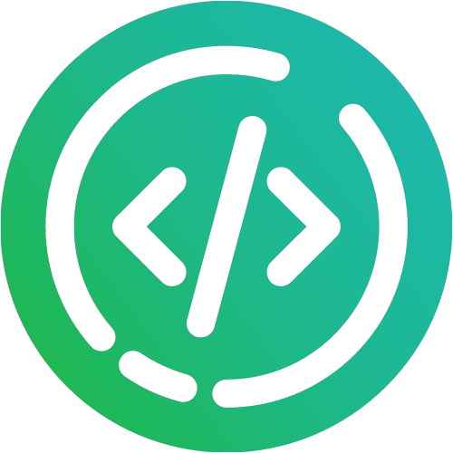
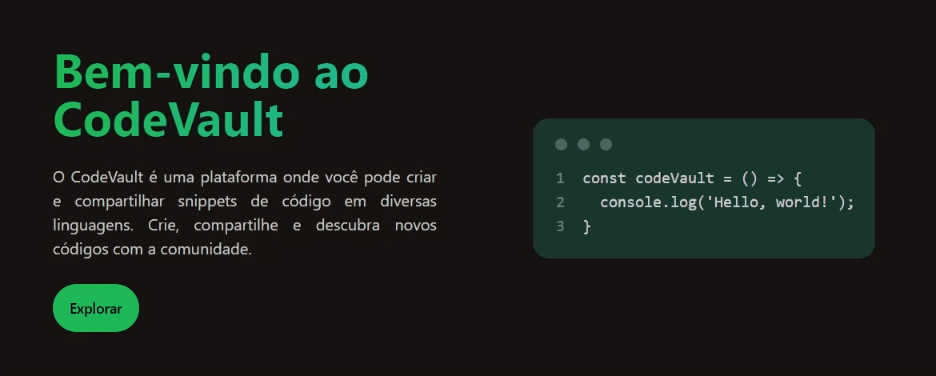
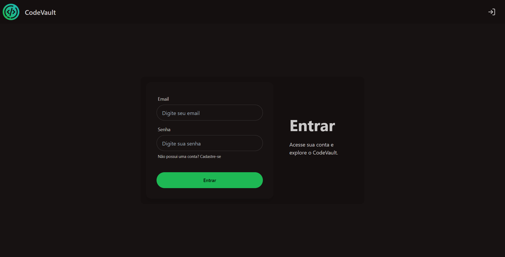
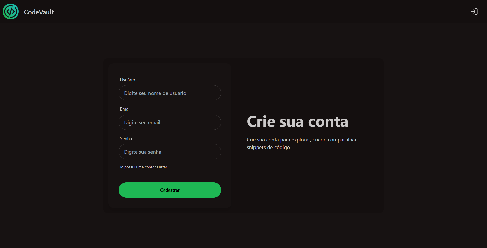

  
  <h1 style="display: inline">CodeVault</h1>

CodeVault é um sistema onde usuários podem encontrar, criar e compartilhar snippets de código em diferentes linguagens de programação.

Projeto em desenvolvimento feito com Angular e Typescript utilizando DaisyUI.

  
  
  

